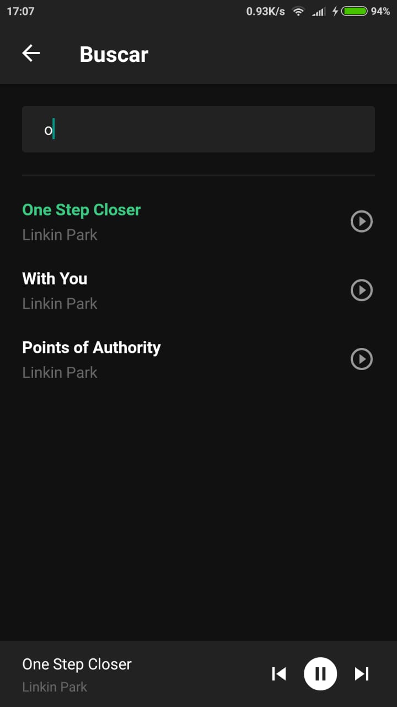
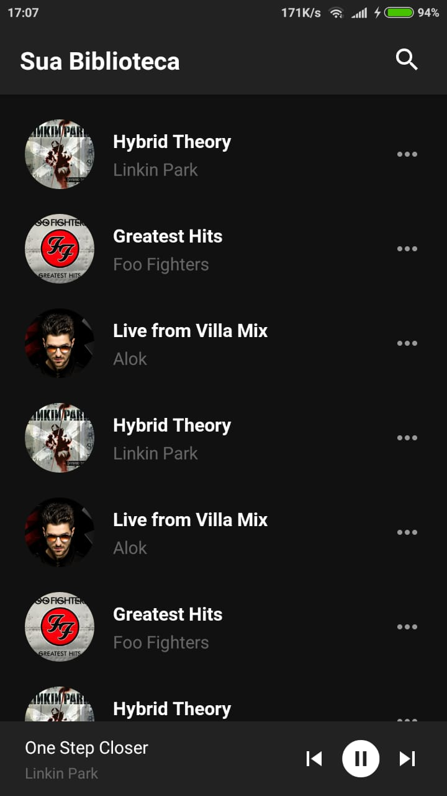
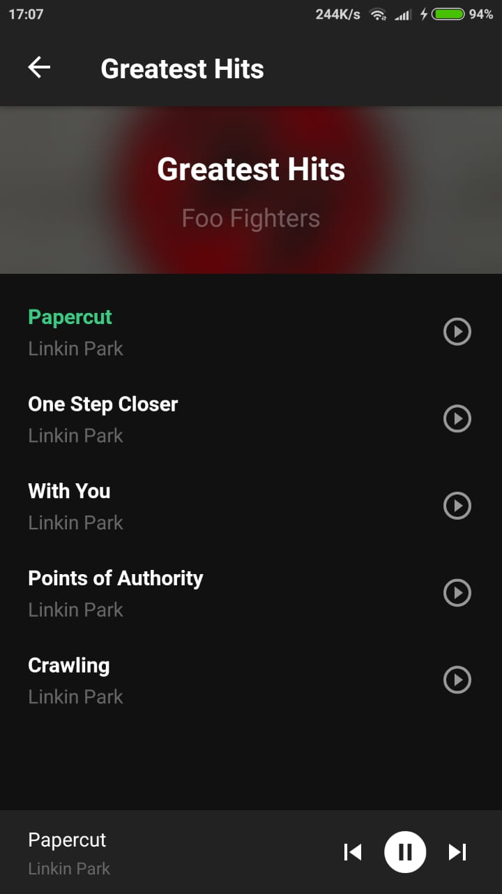

# app-spotify-clone-react-native

<h1>Spotify clone</h1>

<ul>
     <li>Lista de albums</li>
    <li>Lista de musicas de um album</li>
    <li>Lista de músicas</li>
    <li>Pesquisar por uma música</li>
    <li>Tocar, pausar uma musica</li>
    <li>Mudar para música seguinte/anterior</li>
</ul>

     
     
     

